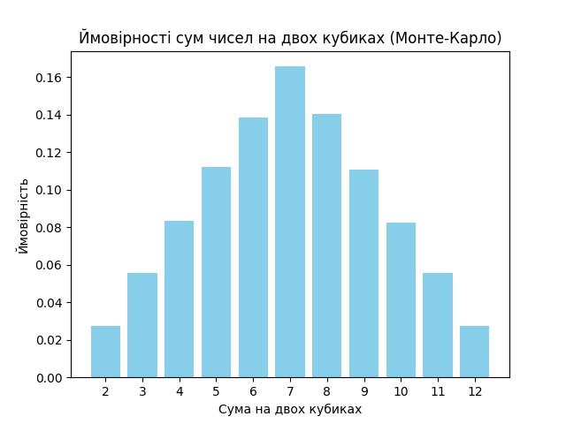

Ймовірності для кожної суми:
Сума 2: ймовірність 2.7330% \
Сума 3: ймовірність 5.5840% \
Сума 4: ймовірність 8.3430%\
Сума 5: ймовірність 11.2290%\
Сума 6: ймовірність 13.8520%\
Сума 7: ймовірність 16.5780%\
Сума 8: ймовірність 14.0610%\
Сума 9: ймовірність 11.0930%\
Сума 10: ймовірність 8.2280%\
Сума 11: ймовірність 5.5650%\
Сума 12: ймовірність 2.7340%

Висновки:\
Результати Монте-Карло дуже близькі до аналітичних (теоретичних) значень.
Невеликі розбіжності можуть виникати через випадковий характер симуляції, але чим більше кидків (наприклад, більше ніж 100,000), тим точніше результати Монте-Карло будуть наближатися до теоретичних ймовірностей.
Для всіх сум, починаючи від 2 до 12, симуляція точно відображає теоретичний розподіл ймовірностей.